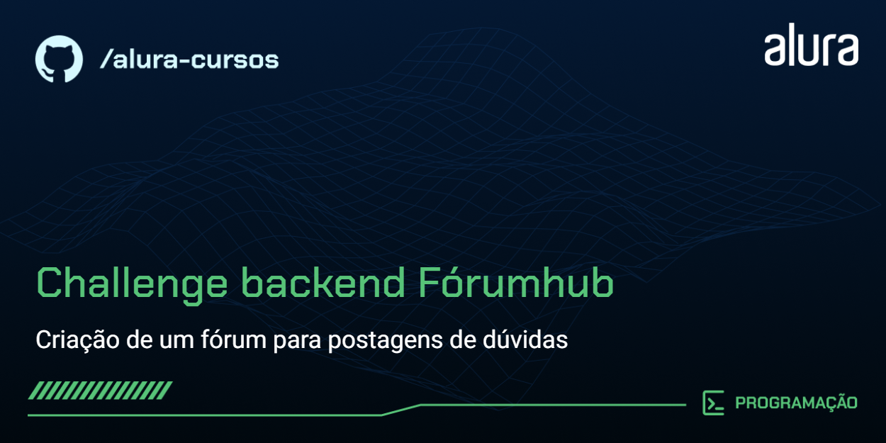

  
# Challenge-Backend-ForumHub

O Fórumhub é uma aplicação onde usuários podem realizar posts de suas dúvidas em relação a algum assunto de algum curso. Usuários podem interagir entre si dando respostas em cima de um determinado tópico em aberto.

## 🔨 Funcionalidades do projeto

- **Criação de Conta:** Usuários podem criar suas próprias contas fornecendo um nome, e-mail e senha.
- **Login/Logout:** Acesso seguro à aplicação com sistema de autenticação.
- **Postagem de Dúvidas:** Usuários podem postar suas dúvidas em categorias específicas relacionadas a cursos.
- **Respostas:** Outros usuários podem responder às dúvidas, promovendo uma interação construtiva.
- **Buscas:** Usuários podem buscar por tópicos recentes, lista todos os tópicos e abrir detalhamento de um tópico específico.

## ✔️ Técnicas e tecnologias utilizadas

- **Backend:** Java 17 com Spring Boot, utilizando Spring Security para autenticação, Spring Validation para validação de dados, e Spring Web para a criação de APIs RESTful, Flyway para controle de versões (Migrations) do Banco de dados.
- **Banco de Dados:** MySQL para armazenamento de dados de forma estruturada e eficiente.
- **Autenticação:** JWT (JSON Web Tokens) para uma autenticação segura e eficiente.

## 🛠️ Como Executar

Para executar o Fórumhub localmente, siga os passos abaixo:

1. Faça um fork do projeto.

2. Clone o repositório: git@github.com:<-usuario->/challenge-backend-ForumHub.git

3. Realize as configuração adequada das variáveis de ambiente no seu projeto. Veja [Configuração](#configuração)

4. Configure as variáveis de ambiente conforme necessário no arquivo `application.properties` e o properties para test `application-test.properties`. 

5. Navegue até a pasta do projeto e instale as dependências: 
   
        cd challenge-backend-ForumHub/Forumhub ./mvnw install

6. Inicie a aplicação:
   
        ./mvnw spring-boot:run

A aplicação estará disponível em `http://localhost:8080`.

Você pode acessar o swagger da aplicação acessando `http://localhost:8080/swagger-ui.html`

## Configuração

### VSCode:

1. Se estiver utilizando o vscode, altere o compilador para uso da versão 17+.
2. Crie a pasta **.vscode** em cd `challenge-backend-ForumHub/Forumhub`.
3. Dentro da pasta .vscode crie o arquivo `.env`.
4. Realize as configurações das variáveis de ambiente dentro do arquivo (Utilizamos as seguintes variáveis):

    DB_ROOT_PASSWORD=`root password` |
    DB_HOST=`host` |
    DB_PORT=`data base port` |
    DB_NAME=`database name` |
    DBTEST_NAME=`test database name` |
    DB_USER=`user` |
    DB_PASSWORD=123456 |
    DB_VERSION=8.0 |
    JWT_SECRET= `secret` 

5. Execute o comando `docker-compose --env-file .vscode/.env up -d`. (Se você está utilizando o windows, será necessário ter o docker desktop instalado)
6. Verifique no docker desktop ou com o comando `docker ps` se o container está executando corretamente.
7. Abra no seu terminal o bash do container com o comando `docker exec -it <container_name> bash` ou vá até o bash do container diretamente pelo **docker desktop**.
8. Acesse com as suas credenciais pré-definidas o banco MySQL e então crie o seu banco de desenvolvimento e o seu banco de teste. 

        minhas configurações no launch.json:
          "configurations": [
                {
                "type": "java",
                "name": "ForumHubApplication",
                "request": "launch",
                "mainClass": "io.github.matheusfy.ForumHub.ForumHubApplication",
                "projectName": "ForumHub",
                "envFile": "${workspaceFolder}/.vscode/.env",
                }
        ]

### Intellij

- Abra o projeto na pasta forumhub.
- Adicione as variáveis de ambiente na configuração de run da application. 
- Verifique a versão do compilador.
- Verifique se as dependências foram instaladas corretamente.
- Rode o projeto.

## Licença

Este projeto está sob a licença MIT. Veja o arquivo `LICENSE` para mais detalhes.

## 📚 Mais informações do curso

Este projeto conta com diversos conhecimentos adiquiridos ao longo da formação especialização em back-end oferecida pela Alura em conjunto com a Oracle no Programa One.

- https://cursos.alura.com.br/course/java-trabalhando-lambdas-streams-spring-framework
- https://cursos.alura.com.br/course/java-persistencia-dados-consultas-spring-data-jpa
- https://cursos.alura.com.br/course/java-criando-primeira-api-conectando-front
- https://cursos.alura.com.br/course/spring-boot-3-desenvolva-api-rest-java
- https://cursos.alura.com.br/course/spring-boot-aplique-boas-praticas-proteja-api-rest
- https://cursos.alura.com.br/course/spring-boot-3-documente-teste-prepare-api-deploy
  
